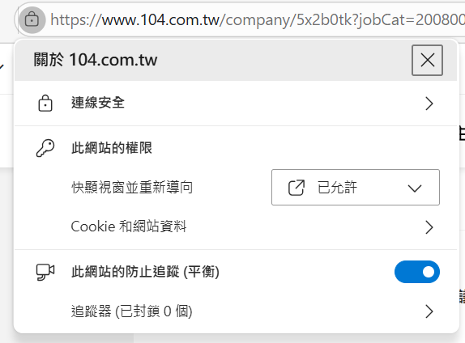

# 104 批量應徵助手

> Chrome 擴充套件 · 在 104 人力銀行搜尋結果頁或公司職缺頁，一鍵批量自動應徵

---

## 展示影片

https://github.com/user-attachments/assets/9e87909e-b333-4a1c-a613-e50f4c3f4fa1

---

## 安裝前準備：開放 104 彈出視窗權限

使用前**必須**先允許 104 開啟彈出視窗，否則應徵分頁無法自動開啟。

1. 在 Chrome / Edge 瀏覽器前往 [104.com.tw](https://www.104.com.tw)
2. 點擊網址列左側的**鎖頭圖示（🔒）**
3. 找到「**快顯視窗並重新導向**」，將設定改為 **已允許**

> ⚠️ 若未開放此權限，點應徵後分頁不會開啟，批量應徵將無法運作。

---

## 功能說明

| 功能 | 說明 |
|------|------|
| **批量選取** | 在搜尋結果或公司職缺頁，勾選多個職缺放入佇列 |
| **自動應徵** | 依序自動開啟應徵表單並點擊「確認送出」|
| **重複應徵處理** | 遇到「已應徵過」提示，自動點擊「仍要再次應徵」繼續送出 |
| **公司提問跳過** | 偵測到需要手動填寫的公司提問時，自動跳過該職缺 |
| **進度監控** | 擴充套件彈出面板即時顯示已送出 / 待處理數量 |
| **清爽介面** | 自動隱藏職缺卡片的描述、福利標籤等非必要資訊 |

---

## 安裝步驟

1. 下載此 Repository（右上角 **Code → Download ZIP**，解壓縮）
2. 打開 Chrome，前往 `chrome://extensions/`
3. 右上角開啟「**開發人員模式**」
4. 點擊「**載入未封裝項目**」，選擇解壓縮後的資料夾
5. 完成！前往 104 搜尋頁即可使用

---

## 使用方式

1. 前往 [104 搜尋結果頁](https://www.104.com.tw/jobs/search/) 或任意公司職缺頁
2. 每張職缺卡片右側會出現 **「放入購物車」** 按鈕，點擊勾選想應徵的職缺
3. 畫面底部浮現控制列，顯示已選取數量
4. 點擊「**開始批次應徵**」，擴充套件自動依序完成應徵
5. 可隨時點擊彈出面板的「停止應徵」中止流程

---

## 注意事項

- 僅供個人使用，請遵守 104 人力銀行使用條款
- 應徵間隔約 1.2 秒，避免對伺服器造成過大負擔
- 若職缺要求填寫公司提問，該職缺會自動跳過（需手動應徵）
